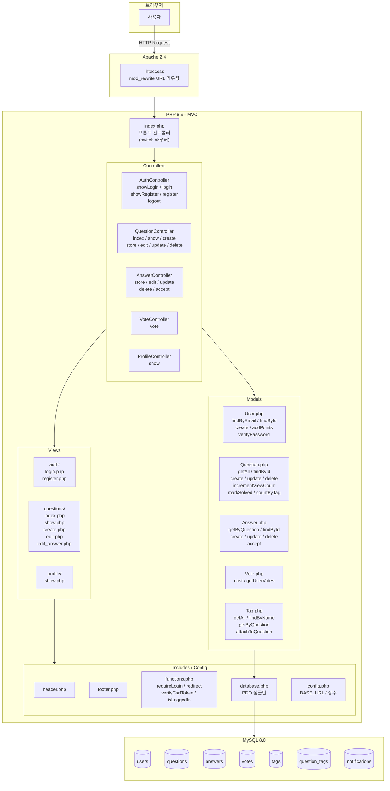
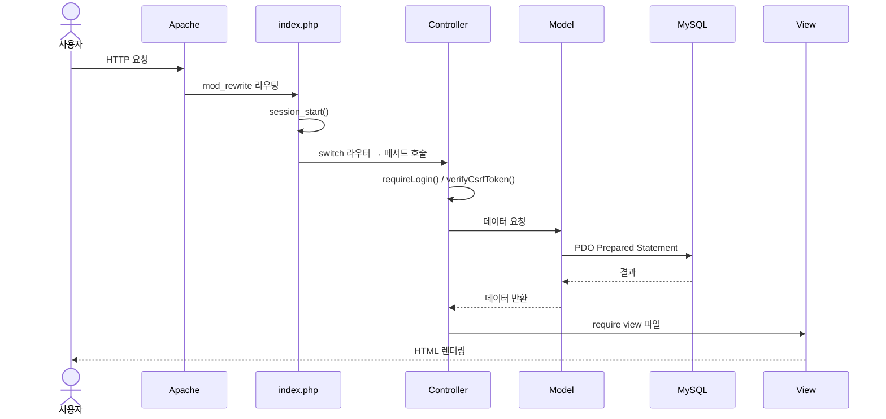
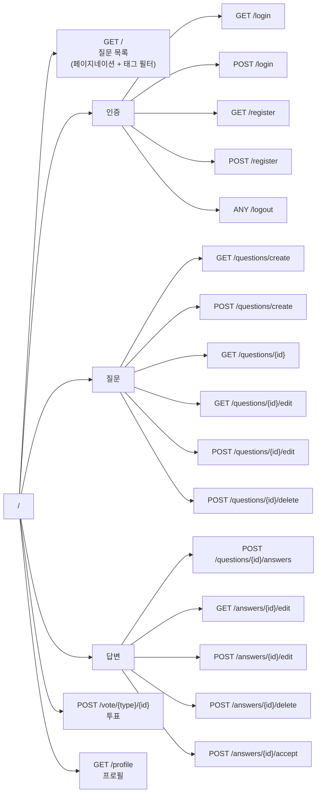
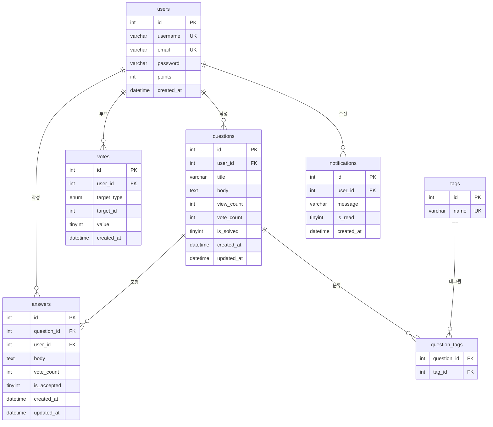

# LAMP Q&A 커뮤니티 블럭도

## 1. 전체 시스템 구조

```mermaid
flowchart TB
    subgraph Browser["브라우저"]
        User["사용자"]
    end

    subgraph Apache["Apache 2.4"]
        htaccess[".htaccess\nmod_rewrite URL 라우팅"]
    end

    subgraph PHP["PHP 8.x - MVC"]
        FC["index.php\n프론트 컨트롤러\n(switch 라우터)"]

        subgraph Controllers["Controllers"]
            AC["AuthController\nshowLogin / login\nshowRegister / register\nlogout"]
            QC["QuestionController\nindex / show / create\nstore / edit / update / delete"]
            AnC["AnswerController\nstore / edit / update\ndelete / accept"]
            VC["VoteController\nvote"]
            PC["ProfileController\nshow"]
        end

        subgraph Models["Models"]
            UM["User.php\nfindByEmail / findById\ncreate / addPoints\nverifyPassword"]
            QM["Question.php\ngetAll / findById\ncreate / update / delete\nincrementViewCount\nmarkSolved / countByTag"]
            AnM["Answer.php\ngetByQuestion / findById\ncreate / update / delete\naccept"]
            VM["Vote.php\ncast / getUserVotes"]
            TM["Tag.php\ngetAll / findByName\ngetByQuestion\nattachToQuestion"]
        end

        subgraph Views["Views"]
            AV["auth/\nlogin.php\nregister.php"]
            QV["questions/\nindex.php\nshow.php\ncreate.php\nedit.php\nedit_answer.php"]
            PV["profile/\nshow.php"]
        end

        subgraph Includes["Includes / Config"]
            H["header.php"]
            F["footer.php"]
            FN["functions.php\nrequireLogin / redirect\nverifyCsrfToken / isLoggedIn"]
            DB["database.php\nPDO 싱글턴"]
            CF["config.php\nBASE_URL / 상수"]
        end
    end

    subgraph MySQL["MySQL 8.0"]
        direction TB
        T1[("users")]
        T2[("questions")]
        T3[("answers")]
        T4[("votes")]
        T5[("tags")]
        T6[("question_tags")]
        T7[("notifications")]
    end

    User -->|HTTP Request| Apache
    Apache --> FC
    FC --> Controllers
    Controllers --> Models
    Controllers --> Views
    Views --> Includes
    Models --> DB
    DB --> MySQL
```

---

## 2. 요청 처리 흐름

```mermaid
sequenceDiagram
    actor U as 사용자
    participant A as Apache
    participant I as index.php
    participant C as Controller
    participant M as Model
    participant DB as MySQL
    participant V as View

    U->>A: HTTP 요청
    A->>I: mod_rewrite 라우팅
    I->>I: session_start()
    I->>C: switch 라우터 → 메서드 호출
    C->>C: requireLogin() / verifyCsrfToken()
    C->>M: 데이터 요청
    M->>DB: PDO Prepared Statement
    DB-->>M: 결과
    M-->>C: 데이터 반환
    C->>V: require view 파일
    V-->>U: HTML 렌더링
```

---

## 3. 라우트 구조

```mermaid
flowchart LR
    Root["/"]

    Root --> Home["GET /\n질문 목록\n(페이지네이션 + 태그 필터)"]

    Root --> Auth["인증"]
    Auth --> L1["GET /login"]
    Auth --> L2["POST /login"]
    Auth --> R1["GET /register"]
    Auth --> R2["POST /register"]
    Auth --> LO["ANY /logout"]

    Root --> Q["질문"]
    Q --> QC["GET /questions/create"]
    Q --> QS["POST /questions/create"]
    Q --> QSH["GET /questions/{id}"]
    Q --> QE["GET /questions/{id}/edit"]
    Q --> QU["POST /questions/{id}/edit"]
    Q --> QD["POST /questions/{id}/delete"]

    Root --> AN["답변"]
    AN --> AS["POST /questions/{id}/answers"]
    AN --> AE["GET /answers/{id}/edit"]
    AN --> AU["POST /answers/{id}/edit"]
    AN --> AD["POST /answers/{id}/delete"]
    AN --> AA["POST /answers/{id}/accept"]

    Root --> V["POST /vote/{type}/{id}\n투표"]
    Root --> P["GET /profile\n프로필"]
```

---

## 4. DB 관계도

```mermaid
erDiagram
    users {
        int id PK
        varchar username UK
        varchar email UK
        varchar password
        int points
        datetime created_at
    }
    questions {
        int id PK
        int user_id FK
        varchar title
        text body
        int view_count
        int vote_count
        tinyint is_solved
        datetime created_at
        datetime updated_at
    }
    answers {
        int id PK
        int question_id FK
        int user_id FK
        text body
        int vote_count
        tinyint is_accepted
        datetime created_at
        datetime updated_at
    }
    votes {
        int id PK
        int user_id FK
        enum target_type
        int target_id
        tinyint value
        datetime created_at
    }
    tags {
        int id PK
        varchar name UK
    }
    question_tags {
        int question_id FK
        int tag_id FK
    }
    notifications {
        int id PK
        int user_id FK
        varchar message
        tinyint is_read
        datetime created_at
    }

    users ||--o{ questions : "작성"
    users ||--o{ answers : "작성"
    users ||--o{ votes : "투표"
    users ||--o{ notifications : "수신"
    questions ||--o{ answers : "포함"
    questions ||--o{ question_tags : "분류"
    tags ||--o{ question_tags : "태그됨"
```

